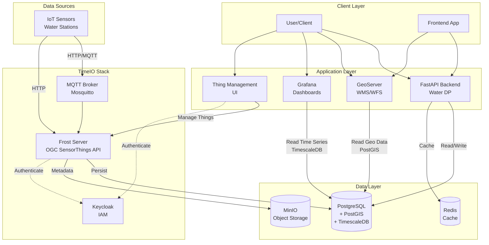

# Water Data Platform

A reliable Python backend for handling requests between databases, GeoServer, time data, and other services. Built with FastAPI, SQLAlchemy, and modern Python best practices.

## Features

- **Database Management**: PostgreSQL with PostGIS support for geospatial data.
- **GeoServer Integration**: Full integration with GeoServer for geospatial services (Layers & Features).
    - **Dynamic BBOX Filtering**: Efficiently load only visible map features.
    - **Single-Item Retrieval**: Fetch individual layers and features by ID.
    - **WMS/WFS Support**: Direct integration with standard OGC services.
- **Time Series Processing**: Powered by **TimeIO** (Frost Server + TimescaleDB).
    - **OGC SensorThings API**: Standardized data ingestion and management.
    - **High Performance**: TimescaleDB for efficient time-series storage and querying.
    - **Linkage**: Direct linking between Map Features (GeoServer) and Water Stations (`feature.properties.station_id`).
    - **Data API**: Retrieve, aggregate, and interpolate hydrological data.
- **RESTful API**: Comprehensive REST API with automatic documentation.
- **Data Models**: Strong typing with Pydantic V2 models (Schema) and SQLAlchemy ORM (DB).
- **Monitoring**: Built-in logging, metrics, and health checks.
- **Docker Support**: Complete containerization with Docker Compose.

## Architecture

The platform follows a modern microservices-inspired architecture:

### Project Structure
```
water_dp/
├── app/
│   ├── api/                 # API endpoints (Geospatial, Time Series, Water Data)
│   │   └── v1/
│   │       └── endpoints/
│   ├── core/               # Core functionality (Config, DB, Logging, Seeding)
│   ├── models/             # SQLAlchemy Database models
│   ├── schemas/            # Pydantic validation schemas
│   ├── services/           # Business logic
│   │   ├── database_service.py    # CRUD for all entities
│   │   ├── geoserver_service.py   # GeoServer interaction
│   │   └── time_series_service.py # TimeIO integration
│   └── main.py            # FastAPI application entry point
├── tests/                 # Unit and integration tests
│   ├── test_services/     # Service layer tests
│   ├── integration/       # Integration tests
│   └── conftest.py        # Test configuration
├── scripts/               # Utility scripts (Verification, Seeding)
├── keycloak/             # Keycloak realm configuration
├── grafana/              # Grafana provisioning
├── alembic/              # Database migrations
├── pyproject.toml        # Poetry dependencies and config
├── docker-compose.yml    # Docker services orchestration
├── Dockerfile           # Application container definition
└── README.md            # This file
```

### 1. Data Layer
- **PostgreSQL with Extensions**: The central database:
    - **PostGIS**: Geospatial data (rivers, regions, boundaries)
    - **TimescaleDB**: Time-series data (high-volume sensor readings)
- **MinIO**: S3-compatible object storage (component of TimeIO stack)
- **Redis**: Caching and message broker

### 2. TimeIO Stack (Sensor Data)
- **Frost Server**: Implements the OGC SensorThings API standards
    - **Role**: Ingestion point for all sensor data
    - **Flow**: `Sensors -> Frost API (HTTP/MQTT) -> TimescaleDB`
- **Thing Management**: UI and API for managing Things, Sensors, and Datastreams
- **Keycloak**: IAM for securing TimeIO services
- **MQTT Broker**: Real-time message bus for sensor data ingestion

### 3. Application Layer
- **FastAPI Backend (Water DP)**:
    - **Role**: Main application logic, serving the frontend and orchestrating data.
    - **Security**: Protected by **Keycloak** (JWT Bearer Token authentication).
    - **Integration**: Queries TimescaleDB directly for analytics (anomaly detection) and lists metadata from the database.
- **GeoServer**:
    - **Role**: Serves geospatial maps (WMS/WFS)
    - **Integration**: Connects to PostGIS tables in PostgreSQL to serve vector layers (e.g., rivers, regions)

### 4. Visualization
- **Grafana**:
    - **Role**: Interactive dashboards for time-series data
    - **Integration**: Connects directly to TimescaleDB to visualize seeded `OBSERVATIONS`

### System Architecture Diagram



## TimeIO Integration
### Why TimeIO?
The project integrates the [TimeIO](https://helmholtz.software/software/timeio) stack to provide a robust, standardized, and scalable solution for handling sensor data.
1.  **Standardization**: Uses the **OGC SensorThings API** (via Frost Server) for data ingestion. This ensures interoperability and a clear schema for Things, Sensors, and Observations.
2.  **Scalability**: Leverages **TimescaleDB** (PostgreSQL extension) for efficient storage and querying of high-frequency time-series data.
3.  **Separation of Concerns**: Decouples data ingestion (IoT devices -> Frost) from application logic (FastAPI -> DB), allowing independent scaling.

### Data Flow
1.  **Ingestion**: 
    - IoT devices or scripts (e.g., `seed_timeio.py`) send data to the **Frost Server** via HTTP or MQTT.
    - Frost validates the data against the OGC model.
2.  **Persistence**:
    - Frost persists the data into **TimescaleDB** (`OBSERVATIONS` table).
    - It handles efficient partitioning and indexing automatically.
    - **MinIO** is used for object storage if needed (e.g., large metadata).
3.  **Consumption**:
    - **FastAPI**: Queries the `OBSERVATIONS` table directly (using raw SQL for performance) to provide analytics endpoints (e.g., `/statistics`, `/anomalies`).
    - **Grafana**: Connects to the same DB to visualize the raw data.
    - **GeoServer**: Joins spatial features with sensor metadata (using `station_id`) to display real-time status on maps.

### Setup Details
The entire stack is containerized in `docker-compose.yml`. Key configuration files:
- `.env`: General application secrets.
- `timeio.env`: Specific configuration for the TimeIO microservices (Auth, DB, MQTT).
    - *Tip*: Use `timeio.env.example` as a template.
- `init.sql`: Ensures `timescaledb` and `postgis` extensions are enabled on startup.

## Security Considerations

> [!WARNING]
> This repository contains default configurations intended for **local development only**.

### 1. Default Credentials
The `timeio.env.example` and `timeio-realm.json` files contain default passwords (e.g., `admin/admin`). **These must be changed before deploying to any production environment.**

### 2. CORS and Redirect URIs
- **CORS**: `CORS_ORIGINS` defaults to `*` to facilitate local development. In production, set this to the specific domain(s) of your frontend application in `.env`.
- **Keycloak Redirects**: The default Keycloak configuration allows redirects to localhost ports (8000, 8080, 8082, 3000). Ensure `scripts/configure_keycloak_realm.py` or your realm configuration is updated to reflect your actual production domains and ports.

### 3. Hardcoded Credentials & Roles
The system is seeded with default users and roles (e.g., in `scripts/configure_keycloak_realm.py`) for ease of development. 

> [!CRITICAL]
> **Production Safety**: You **MUST** modify these hardcoded users, passwords, and role assignments before deploying to any production environment. The default `admin-siki` and `frontendbus` users provide extensive access that would be dangerous if left unchanged.

## Quick Start

### Prerequisites

- Docker & Docker Compose
- (Optional) Python 3.11+ for local script execution

### Installation & Run

1. **Clone the repository**
   ```bash
   git clone <repository-url>
   cd water_dp
   ```
   
2. **Set up environment**
   ```bash
   # Copy environment templates
   cp env.example .env
   cp timeio.env.example timeio.env
   
   # Edit .env and timeio.env if needed.
   # NOTE: timeio.env configures the entire TimeIO stack (DB, Auth, MQTT).

   > [!IMPORTANT]
   > The `timeio.env.example` file contains default credentials (e.g., `admin/admin`) for development convenience.
   > **YOU MUST CHANGE THESE CREDENTIALS IN `timeio.env` BEFORE DEPLOYING TO A PRODUCTION ENVIRONMENT.**
   > Failure to do so will create significant security vulnerabilities.
   ```

3. **Start all services with Docker**
   ```bash
   docker-compose up -d --build
   ```
   This will start a comprehensive stack:
   - **Infrastructure**: TimescaleDB (5432), MinIO, MQTT Broker (1883), Keycloak (8081).
   - **TimeIO**: Frost API (8083), Thing Management (8082).
   - **Application**: GeoServer (8080), FastAPI (8000), Grafana (3000).

4. **Seed Data (Important)**
   To populate the system with initial data (Things, Sensors, Observations, GeoServer Layers), run the reset script:
   ```bash
   # Make sure services are up first
   docker-compose ps
   
   # Run the seeder (requires poetry)
   poetry install
   poetry run python -m app.reset_and_seed
   ```
   *This script drops existing tables, re-initializes schema, and seeds standard stations and time-series data.*

5. **Access the application**
   - **API Docs**: [http://localhost:8000/api/v1/docs](http://localhost:8000/api/v1/docs)
   - **GeoServer Admin**: [http://localhost:8080/geoserver](http://localhost:8080/geoserver) (Default: `admin` / `geoserver`)
   - **Thing Management**: [http://localhost:8082/things](http://localhost:8082/things) (Default: `admin` / `admin` via Keycloak)
   - **Frost API**: [http://localhost:8083/FROST-Server](http://localhost:8083/FROST-Server)
   - **Grafana**: [http://localhost:3000/login](http://localhost:3000/login) (Default: `admin` / `admin`)
   - **Keycloak Console**: [http://localhost:8081/admin](http://localhost:8081/admin) (Default: `admin` / `admin`)
   
   **Default Application Users (Development Only):**
   - **Admin User**: `admin-siki` / `admin-password` (Full API access)
   - **Frontend User**: `frontendbus` / `frontend-password` (Limited access)

### Verification
To verify that the entire stack is working correctly (Layers, Features, Data Linkage, and Time Series content), run the included verification script:

```bash
# Using poetry (recommended)
poetry run python scripts/verify_api.py
```

This script will check:
1.  **Layer Listing**: Confirms `czech_regions` and `czech_republic` layers exist.
2.  **Feature Retrieval**: Fetches features and checks for `station_id` property.
3.  **Data Linkage**: Uses the linked `station_id` to fetch time series metadata and data points.

## Development & Testing

This project uses **Poetry** for dependency management.

### Setup
```bash
# Install dependencies
poetry install

# Activate shell
poetry shell
```

### Running Tests
The project includes a comprehensive test suite using `pytest`.

> [!NOTE]
> Database seeding is automatically disabled during unit tests (`conftest.py` fixture) for speed.

```bash
# Run Unit Tests (Fast, Mocked) - Default (excludes integration)
poetry run pytest

# Run Integration Tests (Requires running stack)
poetry run pytest -m integration

# Run Specific Test Categories (Markers)
poetry run pytest -m api
poetry run pytest -m services
poetry run pytest -m core

# Run Coverage Tests
poetry run pytest tests/test_services/test_time_series_service_coverage.py
```

### Code Structure
- **Services**: Business logic is encapsulated in `app/services/`.
- **Schemas**: Pydantic V2 models (`ConfigDict`, `field_validator`) in `app/schemas/`.
- **Models**: SQLAlchemy models in `app/models/`.

## API Usage Guide

### 1. Water Data (Stations)
- **List Stations**: `GET /api/v1/water-data/stations` (Returns combined Geo + FROST data)

### 2. Geospatial Data
- **List Layers**: `GET /api/v1/geospatial/layers`
- **Get Features (with BBOX)**: `GET /api/v1/geospatial/features?layer_name=czech_regions&bbox=12.0,48.5,18.9,51.1`
- **Get Single Feature**: `GET /api/v1/geospatial/features/{feature_id}?layer_name=czech_regions`

### 3. Time Series Data
- **List Series**: `GET /api/v1/time-series/metadata`
- **Get Data**: `GET /api/v1/time-series/data?series_id={from_metadata_or_feature}`

## Database Migrations

This project uses **Alembic** for managing database schema changes.

### Running Migrations
To apply existing migrations (e.g., when pulling new code):
```bash
poetry run alembic upgrade head
```

### Creating Migrations
When you modify models in `app/models/`, create a new migration script:
```bash
# 1. Generate revision
poetry run alembic revision --autogenerate -m "Description of changes"

# 2. Review the generated file in alembic/versions/

# 3. Apply the migration
poetry run alembic upgrade head
```

## Roadmap: Dynamic Frontend Support
To support a highly customizable frontend (dashboards, maps, sub-portals) with predictive capabilities, the current backend requires the following architectural additions:

### Gap Analysis
1.  **User Configuration Persistence (The "Customizable" Part)**
    - **Missing**: No database tables or API endpoints exist to store user-created layouts.
    - **Why**: If a user creates a "dashboard" with specific graphs and map layers, this configuration must be saved on the backend so it persists across sessions and devices.
    - **Need**: New models (`Dashboard`, `Widget`, `MapConfig`) and generic JSON-storage endpoints.

2.  **Computation & Prediction Engine (The "Complex Computation" Part)**
    - **Missing**: Current analytics are limited to fast SQL aggregations (min/max/avg). There is no infrastructure for running heavy prediction models (AI/ML) or long-running simulations.
    - **Why**: "Predictions on how water will behave" requires complex mathematics that cannot run inside a standard HTTP request.
    - **Need**:
        - **Job Queue** (e.g., Celery/Redis) for asynchronous processing.
        - **Scheduler** for running regular predictions (e.g., "every night at 00:00").
        - **Prediction Service** to interface with ML libraries (scikit-learn, etc.).

3.  **Logical Grouping & Metadata**
    - **Missing**: Sensors are currently just a flat list.
    - **Why**: "Sub-portals" and "Apps" need to group sensors logically (e.g., "Project A Sensors", "Region B Flood Watch").
    - **Distinction**: TimeIO manages the **Physical Inventory** (What sensors exist?). The Water DP backend must manage the **Application Context** (Which sensors belong to "Project X"?).
    - **Need**: `Project` or `App` entities in the database to link Users, Dashboards, and specific Sensors/Layers together.

4.  **Security & Access Control (The "Secure" Part)**
    - **Requirement**: The Python API **must** be protected by authentication middleware before being exposed beyond a trusted local environment. Public, unauthenticated access should be limited to explicitly designated health or info endpoints only.
    - **Why**: User configurations and sensitive sensor data must be protected.
    - **Implementation hint (FastAPI + Keycloak JWT)**:

        ```python
        from fastapi import Depends, FastAPI, HTTPException, status
        from fastapi.security import HTTPBearer, HTTPAuthorizationCredentials
        from jose import JWTError, jwt

        app = FastAPI()
        security = HTTPBearer()

        # These should be configured from environment / settings
        KEYCLOAK_PUBLIC_KEY = "-----BEGIN PUBLIC KEY-----...-----END PUBLIC KEY-----"
        KEYCLOAK_ISSUER = "https://keycloak.example.com/realms/your-realm"
        KEYCLOAK_AUDIENCE = "your-api-client-id"

        def get_current_user(
            token: HTTPAuthorizationCredentials = Depends(security),
        ) -> dict:
            try:
                payload = jwt.decode(
                    token.credentials,
                    KEYCLOAK_PUBLIC_KEY,
                    algorithms=["RS256"],
                    audience=KEYCLOAK_AUDIENCE,
                    issuer=KEYCLOAK_ISSUER,
                )
            except JWTError:
                raise HTTPException(
                    status_code=status.HTTP_401_UNAUTHORIZED,
                    detail="Invalid authentication credentials",
                )
            return payload

        @app.get("/protected-endpoint")
        def protected_endpoint(current_user: dict = Depends(get_current_user)):
            # Example of using roles from Keycloak claims for RBAC:
            roles = current_user.get("realm_access", {}).get("roles", [])
            if "Admin" not in roles:
                raise HTTPException(
                    status_code=status.HTTP_403_FORBIDDEN,
                    detail="Insufficient permissions",
                )
            return {"message": "Secure data for admins only"}
        ```

    - **AuthN (Authentication)**: Validate Keycloak (or compatible) JWT Bearer tokens on every protected request using middleware/dependencies like `HTTPBearer` + JWT verification.
    - **AuthZ (Authorization)**: Enforce role-based access control (RBAC) in route logic based on token claims (e.g., only `"Admin"` roles can create Projects).
5.  **Bulk Data Import (The "Efficient Loading" Part)**
    - **Missing**: No API endpoints or utilities for bulk importing large datasets.
    - **Why**: Initial setup, data migration, or historical data loading requires efficiently inserting thousands/millions of records.
    - **Need**:
        - **Bulk GeoJSON Import**: Load large geographic datasets into PostGIS/GeoServer.
        - **Bulk Time-Series Import**: Efficiently insert millions of sensor readings into TimescaleDB.
        - **CSV/Parquet Support**: Common data formats for hydrology data.
        - **Background Processing**: Use job queue for large imports to avoid timeout.

### TODO
- [ ] **User Config Store**: Design DB schema and API for `UserDashboards` and `WidgetConfigs` (JSONB).
- [ ] **Computation Infrastructure**: Set up a Worker Queue (Celery) and Redis for background tasks.
- [ ] **Prediction Engine**: Create a `PredictionService` that consumes historical TimeIO data, runs a model, and writes "Forecast" data back to TimeIO (as a new Datastream).
- [ ] **Logical Grouping**: Add `Project` / `Group` tables to organize Resources (Layers, Sensors) into "Apps".
- [ ] **Security**: Implement FastAPI Middleware to validate Keycloak Tokens (Validation) and enforce scopes/roles.
- [ ] **Bulk Import**: Create endpoints and utilities for bulk data import (CSV, GeoJSON, Parquet) with background job processing.

### Implementation Plan
To achieve the above goals, we will implement the following:

#### 1. Architecture: The "Worker" Service
We need to decouple heavy computations from the main API.
-   **Add a new container**: `worker` in `docker-compose.yml`.
-   **Technology**: [Celery](https://docs.celeryq.dev/) (Distributed Task Queue).
-   **Broker**: [Redis](https://redis.io/) (Already present in stack).
-   **Workflow**:
    1.  User requests a "Flood Prediction" via API -> `POST /api/v1/jobs/predict`.
    2.  API pushes a task to Redis Queue.
    3.  Worker picks up the task, fetches data from TimeIO, runs the model, and writes results back to TimeIO.

#### 2. Security Layer (AuthN/AuthZ)
-   **Middleware**: Implement a FastAPI `HTTPBearer` dependency.
-   **Library**: `python-keycloak` or `python-jose` to validate JWT signatures from the Keycloak public key endpoint.
-   **Enforcement**:
    ```python
    @router.get("/secure-data", dependencies=[Depends(get_current_user)])
    ```

#### 3. Database Updates (User Context)
We will add new Tables to `app/models/` (via Alembic) to support "Apps" and "Dashboards".
-   **`projects`**: `id`, `name`, `owner_id` (Keycloak User ID), `created_at`.
-   **`dashboards`**: `id`, `project_id`, `layout_config` (JSONB - stores grid positions), `widgets` (JSONB).
-   **`sensors_groups`**: Many-to-Many link between `Projects` and `Things` (TimeIO Stations).

#### 4. Technology Stack Enhancements
-   **Job Queue**: `celery` + `redis`
-   **Machine Learning**: `scikit-learn` or `prophet` (inside the `worker` container).
-   **JSON Storage**: SQLAlchemy `JSONB` type (for flexible dashboard layouts).

#### 5. Bulk Data Import Tools  
We need efficient tools for loading large datasets without blocking the API.
-   **API Endpoints**:
    - `POST /api/v1/bulk/import-geojson` - Upload GeoJSON files for PostGIS/GeoServer
    - `POST /api/v1/bulk/import-timeseries` - Upload CSV with sensor data to TimescaleDB
    - `POST /api/v1/bulk/import-parquet` - Upload Parquet files (efficient for large time-series)
-   **Technologies**:
    - `pandas` (already present) for CSV/Parquet parsing
    - `geopandas` for GeoJSON processing and validation
    - PostgreSQL `COPY` command for fast bulk inserts (10-100x faster than row-by-row)
    - Celery for background processing (large files)
-   **Workflow**:
    1. Upload file via API (file validation and size check)
    2. Push job to Celery queue (returns job ID immediately)
    3. Worker processes file in background
    4. Use database bulk insert (not row-by-row)
    5. Client polls `/api/v1/jobs/{job_id}` for progress/completion

### Fixes
- [x] Use TimeIO to replace the custom time-series storage engine
- [x] Use Keycloak for authentication properly
- [/] Fix security problems with project

## Contributing

1. Fork the repository
2. Create a feature branch
3. Make your changes
4. Add tests
5. Submit a pull request

## License

This project is licensed under the MIT License - see the LICENSE file for details.
