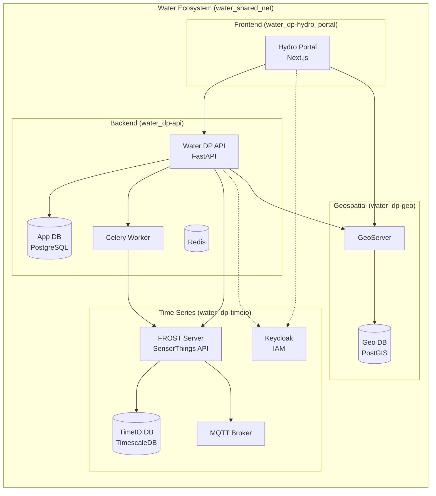

# Water Data Platform (Core Backend)

The **Water Data Platform** is a reliable Python backend for handling requests between databases, GeoServer, time data, and other services. It serves as the **Core Intelligence Layer** of the wider Water Ecosystem.

## 🔗 Component Repositories

*   **Core Backend (API)**: [https://github.com/Siki-ux/water_dp-api](https://github.com/Siki-ux/water_dp-api)
*   **Geospatial Stack**: [https://github.com/Siki-ux/water_dp-geo](https://github.com/Siki-ux/water_dp-geo)
*   **TimeIO Stack**: [https://github.com/Siki-ux/water_dp-timeio](https://github.com/Siki-ux/water_dp-timeio)
*   **Frontend Portal**: [https://github.com/Siki-ux/water_dp-hydro_portal](https://github.com/Siki-ux/water_dp-hydro_portal)

## 🏗️ Ecosystem Architecture

The platform is designed as a modular ecosystem consisting of four independent stacks communicating over a shared Docker network (`water_shared_net`).



## ✨ Features

- **Database Management**: PostgreSQL with PostGIS support for geospatial data (Projects, Users, Computed Data).
- **GeoServer Integration**: 
    - Full integration with the sibling **Geospatial Stack**.
    - **Dynamic BBOX Filtering**: Efficiently load only visible map features.
    - **WMS/WFS Support**: Proxies and manages standard OGC services.
- **Time Series Processing**: 
    - Integration with the **TimeIO Stack** (FROST Server + TimescaleDB).
    - **OGC SensorThings API**: Standardized data ingestion.
    - **High Performance**: Direct querying of TimescaleDB for massive datasets.
- **Computation Engine**:
    - **Async Workers**: Run Python/R/Julia scripts in the background via Celery.
    - **Job Tracking**: Full history of computation jobs and logs.
- **Alerting System**:
    - Real-time monitoring of sensor data against user-defined rules.
- **Unified Identity**:
    - Integrated with **Keycloak** for Single Sign-On (SSO) across Frontend, Backend, and TimeIO.

---

## 🚀 Quick Start

### Prerequisites
*   Docker & Docker Compose
*   Git
*   Poetry (for local development)

### 1. Network Setup
To enable the ecosystem to function, all stacks must share the same project name.
Ensure your `.env` contains:
```ini
COMPOSE_PROJECT_NAME=water_ecosystem
```

### 2. Start the Ecosystem
You can start the independent stacks in any order.

1.  **Time Series & Auth** (`water_dp-timeio`):
    ```bash
    cd ../water_dp-timeio && docker-compose up -d --build
    ```
2.  **Geospatial** (`water_dp-geo`):
    ```bash
    cd ../water_dp-geo && docker-compose up -d --build
    ```
3.  **Backend Core** (This Repo):
    ```bash
    docker-compose up -d --build
    ```
4.  **Frontend** (`water_dp-hydro_portal`):
    ```bash
    cd ../water_dp-hydro_portal && docker-compose up -d --build
    ```

### 3. Access Points
| Service | URL | Default Credentials |
|:---|:---|:---|
| **API Docs** | [http://localhost:8000/api/v1/docs](http://localhost:8000/api/v1/docs) | - |
| **Frontend** | [http://localhost:3000](http://localhost:3000) | Login via Keycloak |
| **GeoServer** | [http://localhost:8080/geoserver](http://localhost:8080/geoserver) | `admin` / `geoserver` |
| **FROST API** | [http://localhost:8083/FROST-Server](http://localhost:8083/FROST-Server) | - |
| **Keycloak** | [http://localhost:8081/admin](http://localhost:8081/admin) | `admin` / `admin` |

---

## 🛠️ Development

### Project Structure
```
water_dp-api/
├── app/
│   ├── api/                 # API Endpoints
│   ├── core/                # Config, DB, Security
│   ├── models/              # SQLAlchemy Models
│   ├── services/            # Business Logic (GeoServer, TimeIO adapters)
│   ├── tasks/               # Celery Tasks
│   └── main.py              # Application Entry
├── scripts/                 # Utility Scripts (Seeding)
├── alembic/                 # Database Migrations
├── tests/                   # Pytest Suite
└── docker-compose.yml       # Stack Definition
```

### Running Locally
To develop the backend logic while keeping infrastructure (DB, GeoServer, FROST) in Docker:

1.  **Install Dependencies**:
    ```bash
    poetry install
    ```
2.  **Run Dev Server**:
    ```bash
    poetry run uvicorn app.main:app --reload
    ```
    *Note: Local execution uses `app/core/config.py` defaults which point to `localhost`. Docker execution uses `.env` overrides to point to container names.*

### Running Tests
The project includes a comprehensive test suite.
```bash
# Run Unit Tests
poetry run pytest

# Run Integration Tests
poetry run pytest -m integration
```

---

## 🛡️ Security & Configuration

### Environment Variables
*   `DATABASE_URL`: Connection to local `water-dp-postgres`.
*   `GEOSERVER_URL`: URL to the sibling GeoServer stack.
*   `FROST_URL`: URL to the sibling TimeIO stack.
*   `KEYCLOAK_URL`: Auth provider URL.

> **Note**: In Docker Mode, `GEOSERVER_URL` and `FROST_URL` are often commented out in `.env` so they resolve to the internal Docker DNS names (`water-dp-geoserver`, `timeio-frost`) automatically.

### Identity Management
The platform uses Keycloak for RBAC (Role-Based Access Control).
*   **Clients**: `timeIO-client` (Frontend), `water-dp-api` (Backend).
*   **Roles**: `admin`, `user`, `editor`.

---

## 📦 Database Schema

The backend manages the **Application State**, while the sibling stacks manage their own specialized data stores.

*   **Water DP DB (`water_dp-api`)**: Projects, Users, Alerts, Computation Jobs.
*   **TimeIO DB (`water_dp-timeio`)**: Sensor Observations (TimescaleDB).
*   **PostGIS DB (`water_dp-geo`)**: Vector Map Layers (Rivers, Watersheds).

### Relationships
*   **Linking**: A **Project** in Water DP is linked to **Sensors** in TimeIO via the `project_sensors` table (storing the FROST `@iot.id`).
*   **Mapping**: A **Feature** in Water DP (PostGIS) is linked to a **Sensor** via the `feature_properties` JSON, enabling map-based data discovery.

---

## 🤝 Contributing

1.  Fork the repository.
2.  Create a feature branch (`feat/new-feature`).
3.  Commit your changes.
4.  Push to the branch.
5.  Create a Pull Request.

**License**: MIT
