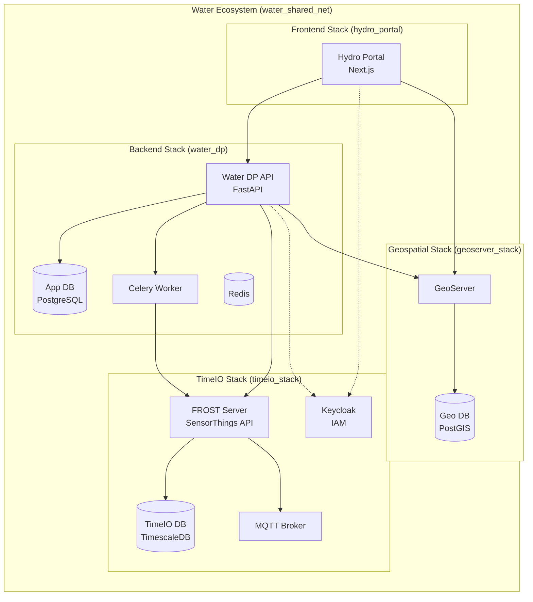

# Water Data Platform (Water Ecosystem)

The **Water Data Platform** is a modern, microservices-based ecosystem for hydrological data management, analysis, and visualization. It integrates geospatial processing (GeoServer), high-frequency time-series data (TimeIO/FROST), and a robust backend (FastAPI) into a unified system.

## 🏗️ Architecture: The Water Ecosystem

The system is composed of **four independent stacks** that communicate over a shared Docker network (`water_shared_net`). This modular design allows each component to be developed, deployed, and scaled independently while functioning as a cohesive unit.



### Key Components

1.  **water_dp (Backend)**: The core logic layer. A FastAPI application handling business logic, data aggregation, computation jobs, and user management.
2.  **timeio_stack (Sensor Data)**: A standardized OGC SensorThings API (FROST Server) backed by TimescaleDB for continuous high-frequency data ingestion and retrieval. Includes Keycloak for Identity Management.
3.  **geoserver_stack (Maps)**: A dedicated GeoServer instance serving WMS/WFS layers for geospatial visualization (Regions, Rivers, Monitoring Stations).
4.  **hydro_portal (Frontend)**: A modern Next.js dashboard for visualizing data, managing projects, and running computations.

---

## 🚀 Quick Start

### Prerequisites
*   **Docker Desktop** (with Docker Compose)
*   **Git**
*   **Poetry** (for local backend development)

### 1. Network Configuration
To enable the "Ecosystem" mode where all stacks can talk to each other, we use a shared project name and network.

**Ensure every stack has the following in its `.env` file:**
```ini
COMPOSE_PROJECT_NAME=water_ecosystem
```
*This is already configured in the provided `.env` files.*

### 2. Start the Stacks
You can start the stacks in any order. The shared network (`water_shared_net`) is managed automatically.

#### Start Identity & Time Series (TimeIO)
```bash
cd timeio_stack
docker-compose up -d --build
```
*Wait for Keycloak and FROST to be healthy.*

#### Start Geospatial Services (GeoServer)
```bash
cd geoserver_stack
docker-compose up -d --build
```

#### Start Application Backend (Water DP)
```bash
cd water_dp
docker-compose up -d --build
```

#### Start Frontend (Hydro Portal)
```bash
cd hydro_portal
docker-compose up -d --build
```

### 3. Access Points
| Service | URL | Default Credentials |
|:---|:---|:---|
| **Frontend** | http://localhost:3000 | (Login via Keycloak) |
| **Backend API** | http://localhost:8000/api/v1/docs | - |
| **GeoServer** | http://localhost:8080/geoserver | admin / geoserver |
| **FROST API** | http://localhost:8083/FROST-Server | - |
| **Thing Mgmt** | http://localhost:8082 | - |
| **Keycloak** | http://localhost:8081/admin | admin / admin |

---

## ⚙️ Configuration

### Environment Variables
Each stack has its own `.env` file.
*   **`water_dp/.env`**: Configures the API, Database URL, and inter-service URLs.
    *   *Note*: `GEOSERVER_URL` and `FROST_URL` are commented out in `.env` to allow Docker to resolve them via internal DNS (`water-dp-geoserver`, `timeio-frost`).
*   **`timeio_stack/.env`**: Configures PostgreSQL, Keycloak, and FROST settings.

### Local Development vs Docker
*   **Docker Mode**: When running via `docker-compose`, services communicate using container names (e.g., `http://timeio-frost:8080`).
*   **Local Mode**: When running `uvicorn app.main:app --reload` locally, the app uses `app/core/config.py` defaults which point to `localhost` (e.g., `http://localhost:8083`).

---

## 🛠️ Development

### Python Backend (water_dp)

1.  **Install Dependencies**
    ```bash
    cd water_dp
    poetry install
    ```

2.  **Run Locally**
    Ensure dependent stacks (TimeIO, GeoServer) are running in Docker.
    ```bash
    poetry shell
    # The config.py defaults are set for localhost access
    uvicorn app.main:app --reload
    ```

3.  **Run Tests**
    ```bash
    poetry run pytest
    ```

4.  **Linting & Formatting**
    ```bash
    poetry run ruff check .
    poetry run black .
    ```

### Database Migrations
We use Alembic for schema changes in the Application DB (`water_app`).
```bash
poetry run alembic upgrade head
```

---

## 📦 Features

*   **Hybrid Data Model**: Combines relational project data (PostgreSQL) with high-volume time series (TimescaleDB) and object storage (MinIO).
*   **Geospatial Integration**: Dynamic WFS querying and filtering of sensors based on map polygons.
*   **Computation Engine**: Async Celery workers for executing user-defined Python, R, or Julia scripts.
*   **Bulk Import**: Specialized endpoints for ingesting massive GeoJSON and CSV datasets.
*   **Unified Auth**: Keycloak SSO across Frontend, Backend, and Management UIs.

## 🤝 Contributing

1.  Fork the repository.
2.  Create a feature branch (`feat/new-feature`).
3.  Commit your changes.
4.  Push to the branch.
5.  Create a Pull Request.

---
**License**: MIT
