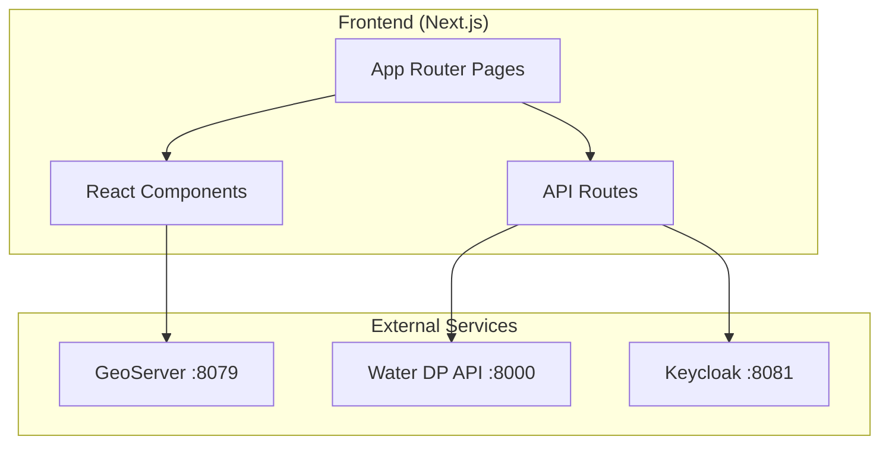

# Water DP - Hydro Portal (Frontend)

A modern Next.js dashboard for visualizing environmental sensor data, managing projects, and exploring geospatial layers.

## ✨ Features

- **🗺️ Interactive Maps**: Leaflet-based maps with sensor markers and GeoServer layers
- **📊 Data Visualization**: Time series charts with zoom and export
- **📁 Project Management**: Create projects and link sensors
- **🔐 Authentication**: Keycloak SSO integration via NextAuth.js
- **🔍 Sensor Browser**: Search and filter sensors from TSM
- **🤖 Simulator**: Create test sensors with simulated data

---

## 🏗️ Architecture



---

## 📁 Project Structure

```
frontend/
├── app/                      # Next.js App Router
│   ├── page.tsx              # Landing page
│   ├── layout.tsx            # Root layout
│   ├── globals.css           # Global styles
│   ├── api/                  # API routes (auth callbacks)
│   ├── auth/                 # Auth pages
│   ├── projects/             # Project pages
│   │   ├── page.tsx          # Project list
│   │   ├── [id]/             # Project detail
│   │   │   ├── sensors/      # Sensor list
│   │   │   ├── map/          # Map view
│   │   │   └── dashboard/    # Dashboard
│   └── groups/               # TSM group browser
├── components/
│   ├── ProjectMap.tsx        # Leaflet map component
│   ├── ProjectSidebar.tsx    # Navigation sidebar
│   ├── ProjectCard.tsx       # Project card widget
│   ├── DashboardCard.tsx     # Dashboard widget
│   ├── AppHeader.tsx         # Top navigation
│   ├── auth/                 # Auth components
│   ├── dashboard/            # Dashboard widgets
│   ├── data/                 # Data visualization
│   ├── parsers/              # Parser config UI
│   └── simulator/            # Simulator components
├── lib/                      # Utilities & API clients
├── types/                    # TypeScript definitions
└── public/                   # Static assets
```

---

## 🚀 Quick Start

### With Docker (Recommended)

The frontend is built and served as part of the main `docker-compose.yml`:

```bash
cd .. # Go to water_dp-api root
docker compose up -d frontend
```

Access at: http://localhost:3000

### Local Development

```bash
# Install dependencies
npm install

# Create environment file
cp .env.example .env.local

# Start dev server
npm run dev
```

Access at: http://localhost:3000

---

## ⚙️ Configuration

### Environment Variables

| Variable | Description | Example |
|----------|-------------|---------|
| `NEXT_PUBLIC_API_URL` | Water DP API URL (browser) | `http://localhost:8000/api/v1` |
| `INTERNAL_API_URL` | API URL (server-side) | `http://water-dp-api:8000/api/v1` |
| `NEXT_PUBLIC_GEOSERVER_URL` | GeoServer URL | `http://localhost:8079/geoserver` |
| `NEXTAUTH_URL` | NextAuth callback URL | `http://localhost:3000` |
| `NEXTAUTH_SECRET` | Session encryption key | Random 32+ char string |
| `AUTH_SECRET` | Alternative auth secret | Same as NEXTAUTH_SECRET |

### Docker Build Args

When building with Docker, these are set at build time:

```yaml
args:
  - NEXT_PUBLIC_API_URL=http://localhost/water-api/api/v1
  - NEXT_PUBLIC_GEOSERVER_URL=http://localhost/geoserver
```

---

## 🧩 Key Components

### ProjectMap

Interactive Leaflet map displaying sensor locations and GeoServer layers.

```tsx
import ProjectMap from '@/components/ProjectMap';

<ProjectMap 
  projectId="uuid" 
  sensors={sensors}
  onSensorClick={(id) => console.log(id)}
/>
```

### Dashboard Widgets

Reusable dashboard components for data visualization:

- `SensorChart` - Time series line chart
- `SensorStats` - Summary statistics
- `AlertPanel` - Active alerts display

---

## 🔐 Authentication

Authentication is handled via NextAuth.js with Keycloak as the OIDC provider.

**Flow:**
1. User clicks "Login"
2. Redirect to Keycloak login page
3. Keycloak authenticates and redirects back
4. NextAuth creates session with JWT
5. API calls include auth token

**Protected Routes:**
All routes under `/projects/` and `/groups/` require authentication.

---

## 🎨 Styling

- **Tailwind CSS** for utility-first styling
- **CSS Variables** for theming in `globals.css`
- **Dark Mode** support via Tailwind's dark variant

---

## 🧪 Development Scripts

```bash
# Development server with hot reload
npm run dev

# Production build
npm run build

# Start production server
npm run start

# Type checking
npm run type-check

# Linting
npm run lint
```

---

## 🐛 Troubleshooting

**Map not loading**
- Check GeoServer is running: `curl http://localhost:8079/geoserver/web/`
- Verify `NEXT_PUBLIC_GEOSERVER_URL` is correct

**API errors**
- Check backend is healthy: `curl http://localhost:8000/health`
- Verify `NEXT_PUBLIC_API_URL` is accessible from browser

**Auth redirect loop**
- Ensure `NEXTAUTH_URL` matches your actual URL
- Check Keycloak client redirect URIs include your frontend URL

---

## 📄 License

MIT License