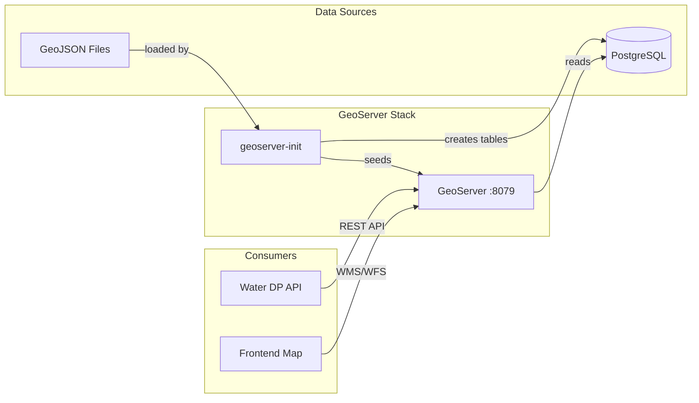

# GeoServer Integration

This directory contains configuration and seed data for the GeoServer geospatial layer service.

## 🏗️ Architecture



---

## 📁 Directory Structure

```
geoserver/
├── conf/
│   └── server.xml          # Tomcat configuration
├── data/
│   ├── *.geojson           # Seed GeoJSON files
│   └── *.json              # Additional data files
└── scripts/
    └── seed_geoserver.py   # Initialization script
```

---

## 🔄 Data Flow

### Initialization Process

1. **GeoServer Starts**: Container launches with empty data directory
2. **Health Check Passes**: GeoServer web UI becomes available
3. **Init Container Runs**: `seed_geoserver.py` executes
4. **Workspace Created**: `water_data` workspace is created via REST API
5. **DataStore Created**: `water_data_store` PostGIS datastore connected to database
6. **Layers Seeded**: Each `.geojson` file in `data/` is:
   - Loaded and parsed
   - Inserted into a PostgreSQL table (schema: `water_dp_geo`)
   - Published as a GeoServer layer

---

## 📦 Components

### seed_geoserver.py

Python script that initializes GeoServer with:

| Function | Purpose |
|----------|---------|
| `wait_for_geoserver()` | Polls REST API until healthy |
| `init_geoserver()` | Creates workspace and datastore |
| `seed_layers()` | Loads GeoJSON files into PostgreSQL and publishes as layers |

### Environment Variables

| Variable | Description | Default |
|----------|-------------|---------|
| `GEOSERVER_URL` | GeoServer REST API URL | `http://geoserver:8080/geoserver` |
| `GEOSERVER_USER` | Admin username | `admin` |
| `GEOSERVER_PASSWORD` | Admin password | `geoserver` |
| `DB_HOST` | PostgreSQL host | `postgres-app` |
| `DB_PORT` | PostgreSQL port | `5432` |
| `DB_NAME` | Database name | `water_app` |
| `DB_USER` | Database user | `postgres` |
| `DB_PASSWORD` | Database password | `postgres` |
| `DB_SCHEMA` | Schema for geo tables | `water_dp_geo` |

---

## 🗺️ Adding New Layers

### Option 1: Add GeoJSON File

1. Place your `.geojson` file in `data/`
2. Restart init container:
   ```bash
   docker compose restart geoserver-init
   ```
3. Layer will be published with filename as layer name

### Option 2: Via GeoServer Admin

1. Access GeoServer at http://localhost:8079/geoserver
2. Login with `admin` / `geoserver`
3. Navigate to **Layers** → **Add new resource**
4. Select `water_data:water_data_store`
5. Configure and publish

### Option 3: Via Water DP API

```bash
# Create layer via API
curl -X POST http://localhost:8000/api/v1/geospatial/layers \
  -H "Content-Type: application/json" \
  -d '{
    "layer_name": "my_layer",
    "title": "My Custom Layer",
    "workspace": "water_data"
  }'
```

---

## 🔗 Accessing Layers

### WMS (Web Map Service)

```
http://localhost:8079/geoserver/water_data/wms?
  service=WMS&
  request=GetMap&
  layers=water_data:layer_name&
  format=image/png&
  width=800&height=600&
  bbox=-180,-90,180,90&
  srs=EPSG:4326
```

### WFS (Web Feature Service)

```
http://localhost:8079/geoserver/water_data/wfs?
  service=WFS&
  request=GetFeature&
  typeName=water_data:layer_name&
  outputFormat=application/json
```

### REST API

```bash
# List layers
curl -u admin:geoserver \
  http://localhost:8079/geoserver/rest/workspaces/water_data/layers.json

# Get layer details
curl -u admin:geoserver \
  http://localhost:8079/geoserver/rest/workspaces/water_data/layers/layer_name.json
```

---

## 🐛 Troubleshooting

**Layers not appearing after restart**
```bash
# Check init logs
docker compose logs geoserver-init

# Re-run initialization
docker compose restart geoserver-init
```

**Database connection errors**
```bash
# Verify PostgreSQL is accessible
docker compose exec geoserver-init \
  python -c "import psycopg2; psycopg2.connect(host='postgres-app', user='postgres', password='postgres')"
```

**GeoServer admin UI not loading**
```bash
# Check GeoServer health
curl http://localhost:8079/geoserver/web/

# View logs
docker compose logs water-dp-geoserver
```

---

## 📄 License

MIT License
